# Reddit Analysis DataStory & Methodologies, Tianxiao Li

## Existence of "Six Degrees of Separation" on Reddit

This is a research project from CSCD25 (Advanced Data Analysis) supervised by Professor Anderson and TA Waller.

It contains the following sections

```
- Abstract
- Research Question
- Hypothesis
- Data Story
    1. Research Analysis
    2. Insights
- Methodologies
    1. Main dataset analysis
    2. Full dataset analysis
    3. Analysis on active users
- References
- Future Work
```

Details are here in the `jupyter-notebook` files: [part_1](files/main_dataset_analysis.ipynb), [part_2](files/full_dataset_analysis.ipynb)

---

## Abstract

The Six degrees of seperation (also known as six handshakes rule) is an idea that all people are six or fewer social connections away from each other. As a result, a chain of "friend of a friend" statement can be made to connect any two people in a maximum of six steps. 

Several studies, such as Milgram's small-world experiment, have been conducted to measure this connectedness empirically, and nowadays the phrase "six degrees of separation" is now often used as a synonym for the idea of the "small world" phenomenon.

    Some ground-breaking phenomenons discovered by researchers are 
	1) There are 19 degrees of separation between any two web pages (by Hungarian physicist Albert-László Barabási in 2013). 
	
	2) shortest path from one Wikipedia to another is 3 degrees, while the furthest is just 11 degrees. 
	
	3) Facebook's data team released two papers in November 2011 which document that amongst all Facebook users at the time of
	research (721 million users with 69 billion friendship links) 
	There is an average distance of 4.74. And by February 2016, the distance is 4.57 on avg on 1.6 billion users 
	(about 22% of the world population)
	
	4) On average, about 50% of people on Twitter are only four steps away from each other.
	...

	It turns out that for social networking websites with large amount of users, the six handshakes rule stays valid. 
	
Reddit, known as one of the most famous social news and discussion website, also has a huge amount of users. According to an analysis on reddit's monthly visitors, as of June 2021, Reddit had almost 48 million monthly active users.	[user stats](https://www.statista.com/statistics/443332/reddit-monthly-visitors/) 

Based on how Reddit works

	Registered members submit posts to the site such as links, text posts, images, and videos, which are then 
    voted up or down and commented by other members
	
I am particularly interested in the existence of the Six Degrees of Separation on Reddit and several research questions related to it.

---

## Research Question:

The goal of this research is to find if given two authors, if there exist a path to get to one from another by tracking user activities in small # of steps.
	
A brief example would be as followed:
```

            user 1 asked "A" 
		 /\
		/  \
answered by user2,user3
	     /         \
	    /           \
commented by user4   user5, user 6
          /	          \       \
         /		    \       \
    asked "C"       answered "C"   asked "B"

Then we say there is a path from 
	user3 -> user1 (user3 commented user1's post "A")
	user1 -> user5 (user5 commented a comment under user1's post)
Hence, user3 is connected with user5 with a path length of 2
```
Here are a list of research questions:
    
1. Does there exist a "friend of friend" chain in reddit users (i.e., connected by commenting)? If so what is the chance of existence?

2. Among all the paths, what is the average path length? Is it small (easy to get from one user to another)?
    
3. Can we form any relation between clusters and length of path?
    (i.e., repeat the previous two problems, but only under same subreddit)
    
4. How do the "active" users affect the length of path?

---

## Hypothesis:
	
1. There is a "Small world"/"Six Handshake Rule" relationshipt between users (all connected)
2. The average path length is ~6 
3. Yes, smaller cluster has smaller path length
	3.1 There also exists path between users under subreddits
	3.2 The path length under subreddits is slightly smaller than the general path length (i.e., ~4 or ~5)
4. The "active" users are not crucial in constructing path, but they are the key factor to keep path length small.
	
Verify the hypothesis/research goals by
	
1 & 2. Check with main dataset
    (a) avg distance for existing path
    (b) possibility for path to exist given any two posts (success/total)

3. Check with full dataset with certain subreddit
   (a) possibility for path to exist given any two posts (success/total)
   (b) avg distance for existing path
    
4. Compare result after removing top k% most active users.

---

# Datastory of Analysis

## 1. Research Analysis

Based on the time that the main_datasets and full_datasets come out, we first analyzed the `main-dataset`. Our `goal` is to `find the shortest path length` of a node to other nodes and `the chance for it to exist`. To do this, we have to build some `graph` and apply the path finding algorithms.

We first considered to construct the graph by mannually read every connection and input into a `adjacency matrix`. It turns out that although this method is `correct`, it `takes too much time` running. And after hours of searching, we see that `networkx` is a proper choice here as it allows us to read graph from `edge_list` which we already have. However, it is still not fast enough as `networkx` is intensive on memory and under suggestion from Professor Anderson, we chose to use `snap.py` to support the graph.

To avoid running time being too long, we used a `subsample of 100k` data frist to analyze the dataset and verify the performance of the algorithms. And if possible, we can just use the result of `100k` data if it makes enough sense.

```
data = comments.sample(100k)
```
Unfotunately, the `100k` data is very spreaded and only helped us verify our algorithms. It only has 3282 effective authors (authors that we have reference in the dataset) and every author is quite disconnected from others.

.png)

The `largest component` of `100k` does not contain many nodes in it, meaning it is `disconnected` (a graph with multiple components). Since if every node is connected, we will have a large component that's almost same as the original graph, so far we have `no progress` on `verifying our hypothesis`.

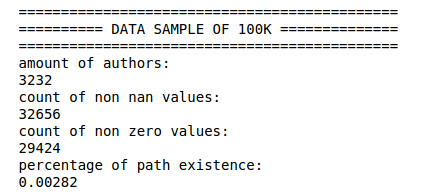

_The `% path existence` is calculated by `nonzero` / `number of authors ** 2`, meaning out of an adjancency matrix of NxN, how many entries are filled with path length._

However, although it did not help us verify the hypothesis, it tells us there's potential for large amount of nodes having `degree = 1` which we should be explicitly `careful` with, as these nodes are kinda isolated from the graph. (they act like the leaves in tree data structure, which does not help us connecting the graph)

**roles deg = 1 nodes**

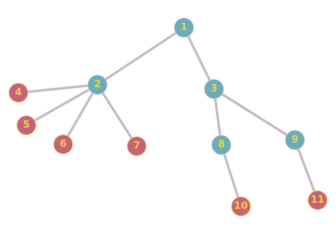

And in fact when we take more data (50% of main dataset), 

`data = comments.sample(frac = 0.5)`

we see the large impact of these `inactive users` (in fact, they might not be inactive, we probably just missed their data from the dataset, but for convenience, we just call them inactive for now). The `percentage of path existence differs a lot`, after we filtered out the inactive users, the `chance for path to exist increased` by a large percentage.

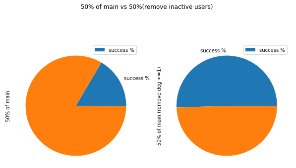

Thus the result supported us that we should filter out the `inactive users`.

We now want to see the pattern of data with respect to the sample % and number of nodes in the graph.

```
for i in [0.01, 0.03, ..., 0.5]:
    data = comments.sample(frac = i)
    analyze "data"
```

which gives us the following visualizations.

**As the % increases, the number of nodes increases (a trivial finding)**

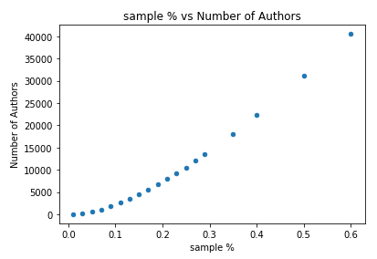

**As sample%/node# increases, the `% Existence` and `avg length` both increases. It looks like the `avg path` will stop increasing once we reach some threshold.**

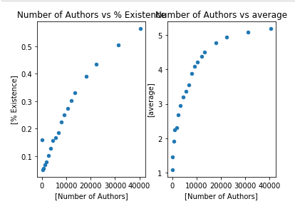

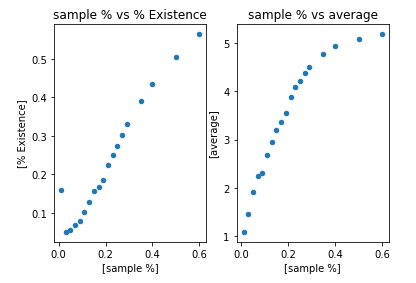

The `% existence` looks linear w.r.t. to x axis, but it is very likely that under large dataset it will follow same slope as the log regression (suddenly increase at some value, then stop increasing and capped at 1).

The `avg path` looks like the `left half` of a `quadratic function that opens downward`, it increases fast at beginning, and capped at some value once we reach the threshold.

```
Given the facts that 1) we can't run entire main_dataset (memory error). 2) Performance not as good as expected
We step forward to use the full_dataset to proceed our analysis.
```

Of course we will not be using the entire full_dataset, we took the subreddit with least amount of data in main_dataset (`PS5`). Since main_dataset is randomly 2% sampled from full_dataset, the distribution should be the same under such a large number (by Law of Large Number).

We repeat the same process as before and here's what we see on the full_dataset. 

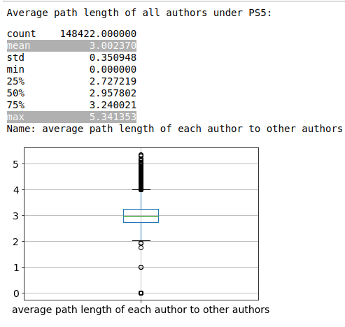

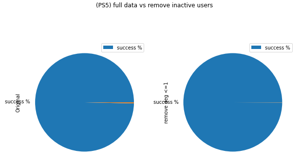

The `% Existence` is >99% with the `avg path length` centred at 3 with `low std.`

From the pie chart, we also see that `no matter` if we filter the `inactive` users, the `% Existence` remains almost same, meaning the graph is `well-defined` (nodes don't have negative impact on constructing path)

These are both signs of successfully verifying the hypothesis. Now we are just interested in how the `active` users affect the network (the `active users` are the users with `high degree` <= they either commented to lots posts, or posted popular submissions)

We filter out the top 1%/5%/10%/25% most active users, then rdomly take 10%/15%/.../30% subgraph. Below is a simple example to represent the process. The `hypothesis` is that both `% Existence` because structure breaks, `Path length` decreases, because the `path length` in small component should be `smaller`

[remove_top_degree_before](pictures/remove_top_degree.png) -> [remove_top_degree_after](pictures/remove_top_degree_2.png)

Using the idea, we get the below analysis result.

**The more active users we remove, the harded it is to construct graph**

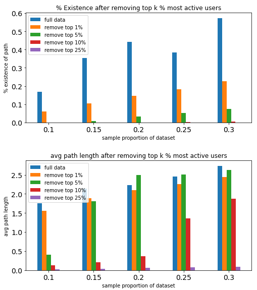 

**Removing top 1% active users has `few impact on path length` (among the existed ones), but `decreases % Existence` by a lot**

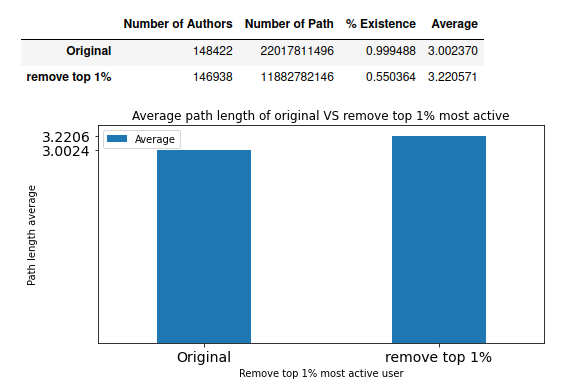

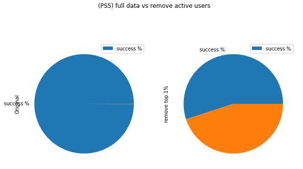

We see that 

```
1) Under subreddits, the authors are connected with small path length
2) It is likely that under the entire dataset, we have same pattern as 1)
3) The active users are important in constructing the graph.
4) The active users are NOT important in making path length small.
```

## 2. Insights from the datastory

1. **The `small world` exists in any society with large user base and some kind of connection between users

As what we expected, there is a `large component` that contains all authors. In other words, the `community of Reddit` is a `small world` such that everyone can reach others in small number of steps.

According to the theoratical findings in [Six Degrees of Separation in Online Society](https://www.researchgate.net/publication/255614427_Six_Degrees_of_Separation_in_Online_Society) that had been supported by multiple mathematic models and measurements, accompanied with the large user base of reddit ([user stats of reddit](https://www.statista.com/statistics/443332/reddit-monthly-visitors/)). We could conclude that the `small world` does `not only` exist in the world-famous online societies like Reddit/Facebook/..., `but also` is presented in any society that has a large amount of user base and some sort of connection that connects everyone (in Reddit: 'comment', in Twitter: 'follow', in Facebook: 'friends',...)

2. **The role of active users is `not` connecting individual users, `but` instead connecting components!!**

Initially we thought that by removing the active users, we will have the connection broken and path length decreased. However, after the analysis, we see that only the `connection` is affected by the active users. The idea behind is that although the `single large component` structure is broken, every new (sub)components are still large enough that follows the trend of average path length. The `Six degree of seperation` theory still holds under each component except that we can't reach nodes from one component from other components.
```
(component_A) <--> active user <--> (component_B) 
>>> every nodes in the graph is connected, form a large component

>>> By removing activer users, we get 
(component_A) | (component_B)
>>> The nodes under each component are still connected, hence pathlength remains almost same.
>>> However, since we can't reach component_B from component_A, the % Existence decreases.
```

According to the idea above, the active users is in fact `not` acting as connection `between individual users`, but instead a `bridge` `between the components` (groups of users).

**We argue that the `active users are mostly from submissions authors`**

Think about changing the graph into a `directed` graph, that is (a -> b if a commented b). Then by our previous definition on active users, the `active users` are expected to come `from the submission authors` more than the comments authors. Why? Because we defined the active users by their degree, and the submission authors can receive hundreds of comments from one single post (`i.e., submissions authors deg += >100 for one action`) while the comment authors can only raise their degree by `1 for one action`. Hence, the active users will be mostly from the submissions authors.

**Now we see why only `% Existence` changed**

Consider the `active users as the submission authors`, if we remove them from the graph, the `component` structure is broken as for each submission authors, there are a lot of comment authors connected with it. Like the `root` of a tree, although there are still sub-trees, the large tree structure is broken.

Recall how we visualized a path in the `research question`? When we remove the active user, we are removing the root, leaving a lot of subtrees connected internally but disconnected from each other. 

`Therefore`, as we remove the active user, we are removing the root, leaving a lot of subtrees connected internally but disconnected from each other. This is `why the path length did not change much`, we are `just changing level of tree by 1` when we remove the root. However, the `% Existence` changed by a lot because every `subtree is disconnected with each other` now.

---


 what will happen? Yes, And 

# Methodologies of Analysis

[project(part1).ipynb](files/main_dataset_analysis.ipynb)

```
- processing main datasets
- analysis on research question 1 and 2
- plotting on all generated results
```

[project(part2).ipynb](files/full_dataset_analysis.ipynb)

```
- load and process full dataset
- analysis on research question 3 and 4
```


## 1. Working on Main Dataset

[project(part1)](files/main_dataset_analysis.ipynb)

### 1.1 Looking at the data

To answer our first two questions, we will need to play around with the main datasets: main_comments and main_submissions. Here's some insights on the datasets.

#### main_comments

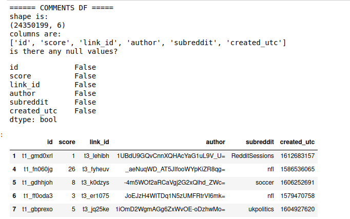

#### main_submissions

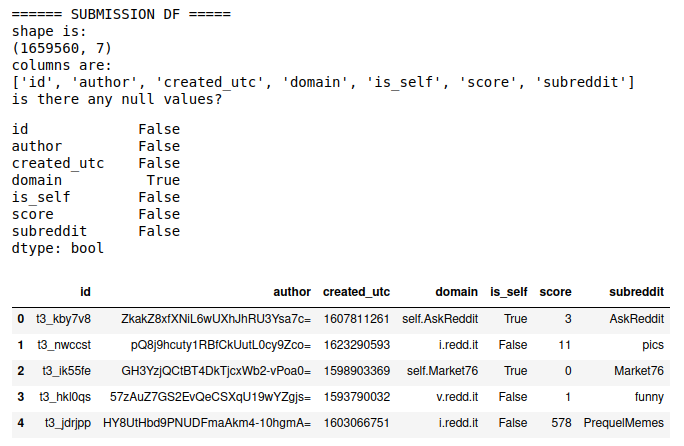

Here we see that there are several rows in `domain` that are `NaN`, after looking into the data, we dropped these rows because they have little influence on the data.

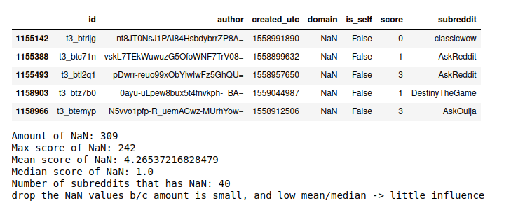

### Insights on the two datasets

**we see that for comments data:**

    - 28M rows, 6 columns
    - no null values
    - mean of score is much higher than median <- potential of outliers on popularity -> careful on prediction
    
**we see that for submissionss data:**

    - 1.8M rows, 7 columns
    - "domain" has null values
        - 309 submissions have NaN domain
        - the mean and median score are both low
        - not all subreddits submissions have NaN domain
        - since number is very low comparing to the amount of samples we have => DROP them
    - mean of score is much higher than median <- potential of outliers on popularity <- for our analysis purpose, no impact
    
**conclusion on oberserving data**

    - for the user/post connection, since link_id in comments is not necessarily a subset of submission_id,
      we need to explicitly choose the data to form our matrix
    - We also notice that link_id (submission_id) starts with 't3_' and comment_id starts with 't1_'


### 1.2 Constructing graph

if a commented b / vice-versa, then a is connected to b

Generally, we check the id <-> link_id connection and build edges between authors.

We can use the "authors" to represent each vertex, and author_i is connected to author_j iff author_i commented author_j (undirected graph)

```
For underiected graph G = (V, E), 
    - V = authors
    - O(|V|) = O(|authors_of_submissions|) + O(|authors_of_comments|)
    - E = (a_i, a_j), a_i's submission is commented by a_j or reverse
    - O(|E|) = |comments|
    - O(|G|) = |V|^2 (NxN matrix representation)
```

We create a column called `link_author` to represent the author of `link_id`

```
id_author = submissions[['id','author']].append(comments[['id','author']])
id_author.columns=['link_id','link_author']
comments.merge(id_author, left_on='link_id', right_on='link_id', inplace=True)
link_df = comments[['id','link_id', 'author','link_author']]
```

gives us 

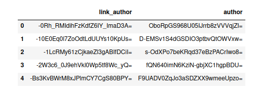


Following the pseudocode below, we can use `networkx`'s builtin function `nx.from_adjancency` to construct graph that allows us to manipulate
```
for row in link_df:
    i, j = row[author], row[link_author]
    adj_matrix[i,j] = adj_matrix[j,i] = 1 (except if i = j)
G = nx.from_adjancency(adj_matrix)
```

We will take subproportion of data to see the pattern (sample(1%~50%))

Below is an example of the largest component of comments.sample(100k)

```
G = nx.from_pandas_adjacency(author_matrix)

components = sorted(nx.connected_components(G), key=len, reverse=True)
largest_component = components[0]

nx.draw_spring(G.subgraph(largest_component))
```

.png)

We see that as we choose more data (sample percentage), the number of authors increases as well.


### 1.3 Finding shortest path

We use `nx`'s builtin function to `find shortest path length` from each node to other nodes. For example:

```
nx.single_source_dijkstra_path_length(G,i,cutoff=10)

for i, j in nodes:
    nx.shortest_path_length(G, source=i, target=j)
```

We also `filtered` the data `by excluding all the nodes with degree <= 1`. We will consider those nodes as isolated nodes that have few connection to other nodes. It turns out this procedure not only saves running time but also maintains the data pattern.

```
G1.DelDegKNodes(1,1)
G1.DelDegKNodes(0,0)    
```

### 1.4 Improving performance

Since this network G is sparse in edges, we use `dijkstra` on each nodes instead of using `floyd-warshall` path finding algorithm. This improved our time complexity from `O(V^3)` to `O(VE Log V)`

`nx.single_source_dijkstra_path_length(G,i,cutoff=10)`

Consider `networkx` is intense on memory, we use `snap.py` to speed up the process.

```
import snap
# we also avoided using cutoff because snap so efficient that not using cutoff won't waste too much time
pathlen = G.GetShortPathAll(i)
```

Here's how our model's performance increased on same amount of data (50% of main datasets):

`Kernal dies (memory error) => ~15hrs (solved memory error) => 3hrs (using snap)`

On full dataset:

`Kernal dies => 330hrs => 55hrs (using snap)`

### 1.5 Plottings

According to the results above, here are some plottings to better help us understand the data. 

All plotting code: [bottom of project(part1)](files/main_dataset_analysis.ipynb)


`% Existence` means the chance for path to exist given any two arbitrary nodes, it is given by `number of path`/`(number of authors)**2`

### 1.6 Insights to answer research questions

According to the results, we can answer research question 1 and 2:

`Q1:` We see that the `chance for a path to exist` `increases` as we have `more nodes` in the graph. However, it is not sufficient to conclude that the network is connected as a large component as we don't have data supporting us. (we stopped at 60% of main_dataset as otherwise memory error). Hence the `conclusion` is that: **The 'user chain' in main_dataset is very likely to exist only if we filter out the isolated nodes**

`Q2:` We only see that as `number of nodes increases`, the `avg path length increases`, but does not have an absolute idea on what the overall path length will be as the value is still increasing (it is likely that the value will be capped at some threshold). Hence, the `conclusion` is that: **we have small path length among the existed paths, but we still need to verify with more detailed dataset.** 

The `assumption` is that the `path length` will remain increasing but `capped at certain value`, which will require us to check in the `full dataset analysis` that uses the smallest subreddit for comprehensive understanding, and also using the entire full dataset for detailed analysis.

### 1.7 Further steps 

(things not in this project, but could be done in future)

`Further steps:` Perform same analysis on some sort of full dataset. Given the circumstance that my device can't handle the entire full dataset, we will take all posts under `PS5 (the smallest subreddit)` for analysis. We can consider processing the full dataset for a more comprehensive understanding once we get a powerful enough device, but not during this research.

---

## 2. Full Dataset 

[project(part2).ipynb](files/full_dataset_analysis.ipynb)

### 2.1 Find smallest subreddit

Since `main_dataset` is **2% downsampled** from the `full dataset`, under large number it represents the distribution of subreddits.
```
# 5 subreddits with least posts
main_comments = pd.read_csv('main_comments.csv.gz')
main_comments.gropuby('subreddit')['subreddit'].value_counts().sort_values().head(5)
```
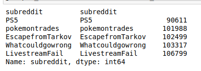

### 2.2 Load data

Then we load the `comments` and `submissions` data as below:
```
start_date = datetime.date(2019, 1, 1)
end_date = datetime.date(2021, 6, 30)
delta = datetime.timedelta(days=1)
PS5 = pd.DataFrame()

for i in tqdm(range((end_date - start_date).days)):  
    url_name = 'http://csslab.cs.toronto.edu/cscd25/full/comments_' + str(start_date + i*delta) +'.csv.gz'
    df = pd.read_csv(url_name)    
    df = df[df.author != '[deleted]' & df.author != 'AutoModerator'] # exclude [deleted] and [auto moderator]
    PS5 = PS5.append(df.loc[df.subreddit == 'PS5'])
```

### 2.3 verify snap and filtering

We `verified` that `snap` works on sample(10k) and sample(50k):

`% Existence` means the chance for path to exist given any two arbitrary nodes, it is given by `number of path`/`number of authors)**2`

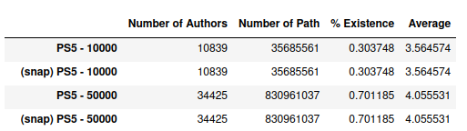

We also verified that filter out `inactive (deg<=1) users` is helpful (saves time, maintains pattern):


### 2.4 Find Path

Then perform similar analysis as above steps (use `snap` to find smallest path length). 

```
G1.DelDegKNodes(1,1)
G1.DelDegKNodes(0,0)    

use snap to find shortest path length
```

### 2.5 Plottings

According to the results above, here are some plottings to better help us understand the data. 

All plotting code: [bottom of project(part1)](files/main_dataset_analysis.ipynb)


### 2.6 Insights to answer research questions

Now we are able to answer `research question 3`.

`Q3:` Under subreddit PS5, the users are `strongly connected` (>99% chance for path to exist between arbitrary users). Different from our hypothesis (pathlen ~= 4, 5) the `average path length is ~3.0`. **Hence users are strongly connected with small path length under subreddits**

### 2.7 Further steps 

(things not in this project, but could be done in future)

`Further Steps:` We could verify this on other subreddits in the future. The `assumption` is all subreddits follow `same pattern`.

---

## 3. Analyze active users

[project(part2).ipynb](files/full_dataset_analysis.ipynb)

### 3.1 Filter users

We consider `filter out` the top 1%/5%/10%/25% `most active` users. Then take random 10%/15%/.../30% of users as subgraph to compare their result to save running time. As we see in plottings from above (1.5 plotting), after removing the nodes with deg<=1, the subgraph maintains same pattern as the full graph.

```
# filtering and subgraphing
nodes = G.nodes() sorted by degree in descending order

for i in [0.01, 0.05, 0.1, 0.25]:
    # filter out top i% nodes
    sub_nodes = nodes[len(nodes)*i:]
    
    # subgraph of 10%/15%/.../30% users (not use full to save time)
    for j in [0.1, 0.15, ..., 0.3]:	
	sub_G = G.subgraph(sub_nodes.sample(frac = j))
        find shortest path length of each node in sub_G

Compare all the results
```

It is also important for us to `use some full data`, so we also did

```
filter out top 1% most active users
find path length on subgraph that exclude these nodes
```

### 3.2 Plotting

According to the results above, here are some plottings to better help us understand the data. 

All plotting code: [bottom of project(part1)](files/main_dataset_analysis.ipynb)

  


### 3.3 Insights to answer research questions

Now we are able to answer `research question 4`.

`Q4:` According to the first bar chart, we see that as we `remove more active users`, the % of existence `decreases`. This means that the `active users` are `important in constructing network`. **The more activer users we exclude, the less likely a path will exist.** Pie plotting on the full analysis after filtering the top1% further supported this. As the `% Existence` decreased from `99% to 55%`. Hence, **the active users indeed act as an important role in connecting users together**. 

However, looking at the second bar chart, we see that among existed paths, `avg(pathlen) did not change` much after we `remove top 1% active users`. Hence, **the active users affect path length, but not as much as they connect users**

## References:

[Wikipedia](https://en.wikipedia.org/wiki/Six_degrees_of_separation)

[floyd vs dijkstra](https://www.geeksforgeeks.org/comparison-dijkstras-floyd-warshall-algorithms/)

[snap.py](https://snap.stanford.edu/snappy/)

[convert pandas to snap](https://stackoverflow.com/questions/51780621/converting-pandas-dataframe-to-snap-py)

[networkx 1](https://stackoverflow.com/questions/14011600/sorting-a-networkx-graph-object-python), [networkx 2](https://stackoverflow.com/questions/50884035/networkx-calculating-and-storing-shortest-paths-on-a-graph-to-a-pandas-data-fra)

[Generalists and Specialists: Using Community Embeddings to Quantify Activity Diversity in Online Platforms by Isaac Waller and Ashton Anderson](http://csslab.cs.toronto.edu/gs/actdiv-www2019.pdf)

[Zhang, Lei & Tu, Wanqing. (2009). Six Degrees of Separation in Online Society. ](https://www.researchgate.net/publication/255614427_Six_Degrees_of_Separation_in_Online_Society)

---

# Summary

[project(part1).ipynb](files/main_dataset_analysis.ipynb)

[project(part2).ipynb](files/full_dataset_analysis.ipynb)


`Q1:` We see that the `chance for a path to exist` `increases` as we have `more nodes` in the graph. However, it is not sufficient to conclude that the network is connected as a large component as we don't have data supporting us. (we stopped at 60% of main_dataset as otherwise memory error). Hence the `conclusion` is that: **The 'user chain' in main_dataset is very likely to exist only if we filter out the isolated nodes**

`Q2:` We only see that as `number of nodes increases`, the `avg path length increases`, but does not have an absolute idea on what the overall path length will be as the value is still increasing (it is likely that the value will be capped at some threshold). Hence, the `conclusion` is that: **we have small path length among the existed paths, but we still need to verify with more detailed dataset.** 

The `assumption` is that the `path length` will remain increasing but `capped at certain value`, which will require us to check in the `full dataset analysis` that uses the smallest subreddit for comprehensive understanding, and also using the entire full dataset for detailed analysis.

`Q3:` Under subreddit PS5, the users are `strongly connected` (>99% chance for path to exist between arbitrary users). Different from our hypothesis (pathlen ~= 4, 5) the `average path length is ~3.0`. **Hence users are strongly connected with small path length under subreddits**

`Q4:` According to the first bar chart, we see that as we `remove more active users`, the % of existence `decreases`. This means that the `active users` are `important in constructing network`. **The more activer users we exclude, the less likely a path will exist.** Pie plotting on the full analysis after filtering the top1% further supported this. As the `% Existence` decreased from `99% to 55%`. Hence, **the active users indeed act as an important role in connecting users together**. 

---

# Future work

If can get more powerful device, try running with completely full dataset to verify hypothesis and assumption we had throughout the research.

During this research, there's not enough evidence to say anything about the roles of generalist and specialist. In future we can consider focusing on the connection between the research and the paper.

Since it is very likely that we can't run the full dataset on any personal devices, also consider to build some algorithm. The algorithm should be able to predict the avg path length of a user to other users.
```
- we dont need to predict % existence as we already found that the users can become one large component.
- this is actually one of my research goals at the beginning, but was abondoned because it will require way too much work.
- features to consider? word freq, scores (avg score the author earned), # of authors connected.
- models to consider? decision tree, lin. regression on # of authors and scores.
```

---

This is the end of my research datastory and methodologies, I have attached the links to all my working files under the topic `Methodologies` and `Summary`. If there's anything about the project that interests you, please do not hesitate to contact me at tonyli.li@mail.utoronto.ca

Thanks for your patience.
