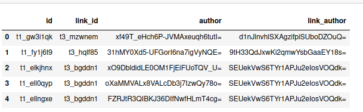

## Reddit Analysis DataStory, Tianxiao Li

You can use the [editor on GitHub](https://github.com/tonyli1121/Reddit-Analysis/edit/gh-pages/index.md) to maintain and preview the content for your website in Markdown files.

Whenever you commit to this repository, GitHub Pages will run [Jekyll](https://jekyllrb.com/) to rebuild the pages in your site, from the content in your Markdown files.

### Markdown

Markdown is a lightweight and easy-to-use syntax for styling your writing. It includes conventions for

```markdown
Syntax highlighted code block

# Header 1
## Header 2
### Header 3

- Bulleted
- List

1. Numbered
2. List

**Bold** and _Italic_ and `Code` text

[Link](url) and 
```

For more details see [Basic writing and formatting syntax](https://docs.github.com/en/github/writing-on-github/getting-started-with-writing-and-formatting-on-github/basic-writing-and-formatting-syntax).

### Jekyll Themes

Your Pages site will use the layout and styles from the Jekyll theme you have selected in your [repository settings](https://github.com/tonyli1121/Reddit-Analysis/settings/pages). The name of this theme is saved in the Jekyll `_config.yml` configuration file.

### Support or Contact

Having trouble with Pages? Check out our [documentation](https://docs.github.com/categories/github-pages-basics/) or [contact support](https://support.github.com/contact) and we’ll help you sort it out.


# Existence of "Six Degrees of Separation" on Reddit - Potential of Quick Information Flow

This is a research project from CSCD25 (Advanced Data Analysis) supervised by Professor Anderson and TA Waller.

---

## Abstract

The Six degrees of seperation (also known as six handshakes rule) is an idea that all people are six or fewer social connections away from each other. As a result, a chain of "friend of a friend" statement can be made to connect any two people in a maximum of six steps. 

Several studies, such as Milgram's small-world experiment, have been conducted to measure this connectedness empirically, and nowadays the phrase "six degrees of separation" is now often used as a synonym for the idea of the "small world" phenomenon.

    Some ground-breaking phenomenons discovered by researchers are 
	1) There are 19 degrees of separation between any two web pages (by Hungarian physicist Albert-László Barabási in 2013). 
	
	2) shortest path from one Wikipedia to another is 3 degrees, while the furthest is just 11 degrees. 
	
	3) Facebook's data team released two papers in November 2011 which document that amongst all Facebook users at the time of
	research (721 million users with 69 billion friendship links) 
	There is an average distance of 4.74. And by February 2016, the distance is 4.57 on avg on 1.6 billion users 
	(about 22% of the world population)
	
	4) On average, about 50% of people on Twitter are only four steps away from each other.
	...

	It turns out that for social networking websites with large amount of users, the six handshakes rule stays valid. 
	
Reddit, known as one of the most famous social news and discussion website, also has a huge amount of users. According to an analysis on reddit's monthly visitors, as of June 2021, Reddit had almost 48 million monthly active users.	[user stats](https://www.statista.com/statistics/443332/reddit-monthly-visitors/) 

Based on how Reddit works

	Registered members submit posts to the site such as links, text posts, images, and videos, which are then 
    voted up or down and commented by other members
	
I am particularly interested in the existence of the Six Degrees of Separation on Reddit and several research questions related to it.

---

## Research Question:

The goal of this research is to find if given two authors, if there exist a path to get to one from another by tracking user activities in small # of steps.
	
A brief example would be as followed:
```

            user 1 asked "A" 
		 /\
		/  \
answered by user2,user3
	     /         \
	    /           \
commented by user4   user5, user 6
          /	          \       \
         /		    \       \
    asked "C"       answered "C"   asked "B"

Then we say there is a path from 
	user3 -> user1 (user3 commented user1's post "A")
	user1 -> user5 (user5 commented a comment under user1's post)
Hence, user3 is connected with user5 with a path length of 2
```
Here are a list of research questions:
    
1. Does there exist a "friend of friend" chain in reddit users (i.e., connected by commenting)? If so what is the chance of existence?

2. Among all the paths, what is the average path length? Is it small (easy to get from one user to another)?
    
3. Can we form any relation between clusters and length of path?
    (i.e., repeat the previous two problems, but only under same subreddit)
    
4. How do the "active" users affect the length of path?

---

## Hypothesis:
	
1. There is a "Small world"/"Six Handshake Rule" between users
2. The average path length is ~6 
3. Yes, smaller cluster has smaller path length
	3.1 There also exists path between users under subreddits
	3.2 The path length under subreddits is slightly smaller than the general path length (i.e., ~4 or ~5)
4. The "active" users are not crucial in constructing path, but they are the key factor to keep path length small.
	
Verify the hypothesis/research goals by
	
1 & 2. Check with main dataset
    (a) avg distance for existing path
    (b) possibility for path to exist given any two posts (success/total)

3. Check with full dataset with certain subreddit
   (a) possibility for path to exist given any two posts (success/total)
   (b) avg distance for existing path
    
3. Compare result after removing top k% most active users.

---

## 1. Working on Main Dataset

### 1.1 Looking at the data

To answer our first two questions, we will need to play around with the main datasets: main_comments and main_submissions. Here's some insights on the datasets.

#### main_comments


#### main_submissions


Here we see that there are several rows in `domain` that are `NaN`, after looking into the data, we dropped these rows because they have little influence on the data.


### Insights on the two datasets

**we see that for comments data:**

    - 28M rows, 6 columns
    - no null values
    - mean of score is much higher than median <- potential of outliers on popularity -> careful on prediction
    
**we see that for submissionss data:**

    - 1.8M rows, 7 columns
    - "domain" has null values
        - 309 submissions have NaN domain
        - the mean and median score are both low
        - not all subreddits submissions have NaN domain
        - since number is very low comparing to the amount of samples we have => DROP them
    - mean of score is much higher than median <- potential of outliers on popularity <- for our analysis purpose, no impact
    
**conclusion on oberserving data**

    - for the user/post connection, since link_id in comments is not necessarily a subset of submission_id,
      we need to explicitly choose the data to form our matrix
    - We also notice that link_id (submission_id) starts with 't3_' and comment_id starts with 't1_'


### 1.2 Constructing graph

if a commented b / vice-versa, then a is connected to b

Generally, we check the id <-> link_id connection and build edges between authors.

We can use the "authors" to represent each vertex, and author_i is connected to author_j iff author_i commented author_j (undirected graph)

```
For underiected graph G = (V, E), 
    - V = authors
    - O(|V|) = O(|authors_of_submissions|) + O(|authors_of_comments|)
    - E = (a_i, a_j), a_i's submission is commented by a_j or reverse
    - O(|E|) = |comments|
    - O(|G|) = |V|^2 (NxN matrix representation)
```

We create a column called `link_author` to represent the author of `link_id`

```
id_author = submissions[['id','author']].append(comments[['id','author']])
id_author.columns=['link_id','link_author']
comments.merge(id_author, left_on='link_id', right_on='link_id', inplace=True)
link_df = comments[['id','link_id', 'author','link_author']]
```

gives us 


Following the pseudocode below, we can use `networkx`'s builtin function `nx.from_adjancency` to construct graph that allows us to manipulate
```
for row in link_df:
    i, j = row[author], row[link_author]
    adj_matrix[i,j] = adj_matrix[j,i] = 1 (except if i = j)
G = nx.from_adjancency(adj_matrix)
```

Below is an example of the largest component of comments.sample(100k)

.png)

This shows that the points are connected with a small path length **in this component**, but disconnected with other nodes. Will this be the same case if we use more data?

### 1.3 Finding shortest path

We use `nx`'s builtin function to find shortest path length from each node to other nodes. Below are the results.

We also filtered the data by excluding all the nodes with degree <= 1. We will consider those nodes as isolated nodes that have few connection to other nodes. It turns out this procedure not only saves running time but also maintains the data pattern.

```
G1.DelDegKNodes(1,1)
G1.DelDegKNodes(0,0)    
```

According to the results above, here are some plottings to better help us understand the data


### 1.4 Improving performance

Since this network G is sparse in edges, we use `dijkstra` on each nodes instead of using `floyd-warshall` path finding algorithm. This improved our time complexity from `O(V^3)` to `O(VE Log V)`

`nx.single_source_dijkstra_path_length(G,i,cutoff=10)`

Consider `networkx` is intense on memory, we use `snap.py` to speed up the process.

```
import snap
# we also avoided using cutoff because snap so efficient that not using cutoff won't waste too much time
pathlen = G.GetShortPathAll(i)
```

Here's how our model's performance increased on same amount of data (50% of main datasets):

`Kernal dies (memory error) => ~330hrs (did not use nx) => 15hrs (dijkstra) => 1~2hr(snap.py on filtered data)`

Evidence that using filtered data g

```
GRAPHS
```
`% Existence` means the chance for path to exist given any two arbitrary nodes, it is given by `number of path`/`(number of authors)**2`

### 1.5 Insights to answer research questions

According to the results, we can answer research question 1 and 2:

`Q1:` We see that the chance for a path to exist increases as we have more nodes in the graph. However, it is not sufficient to conclude that the network is connected as a large component as we don't have data supporting us. (we stopped at 60% of main_dataset as otherwise memory error). Hence the conclusion is that: **The 'user chain' in main_dataset exists only if we filter out the isolated nodes**

`Q2:` We only see that as number of nodes increases, the avg path length increases. Although the number is small, it does not represent the overall path length. **Hence, we have small path length among the existed paths, but it does not represent the overall path length as there's very few path existed in the graph.** 

The assumption is that the path length will remain increasing but capped at certain value (similar pattern as the log regression capped at 1), which will require us to check in the `full dataset analysis` that uses the smallest subreddit for comprehensive understanding, and also using the entire full dataset for detailed analysis.

### 1.6 Further steps 

(things not in this project, but could be done in future)

`Further steps:` Perform same analysis on some sort of full dataset. Given the circumstance that my device can't handle the entire full dataset, we will take all posts under `PS5 (the smallest subreddit)` for analysis. We can consider processing the full dataset for a more comprehensive understanding once we get a powerful enough device, but not during this research.

---

## 2. Full Dataset 

[jupyter-notebook file (full_dataset_analysis.ipynb)](full_dataset_analysis.ipynb)

### 2.1 Find smallest subreddit

Since `main_dataset` is **2% downsampled** from the `full dataset`, under large number it represents the distribution of subreddits.
```
# 5 subreddits with least posts
main_comments = pd.read_csv('main_comments.csv.gz')
main_comments.gropuby('subreddit')['subreddit'].value_counts().sort_values().head(5)
```


### 2.2 Load data

Then we load the `comments` and `submissions` data as below:
```
start_date = datetime.date(2019, 1, 1)
end_date = datetime.date(2021, 6, 30)
delta = datetime.timedelta(days=1)
PS5 = pd.DataFrame()

for i in tqdm(range((end_date - start_date).days)):  
    url_name = 'http://csslab.cs.toronto.edu/cscd25/full/comments_' + str(start_date + i*delta) +'.csv.gz'
    df = pd.read_csv(url_name)    
    df = df[df.author != '[deleted]' & df.author != 'AutoModerator'] # exclude [deleted] and [auto moderator]
    PS5 = PS5.append(df.loc[df.subreddit == 'PS5'])
```

### 2.3 verify snap and filtering

We verified that `snap` works on sample(10k) and sample(50k):

`% Existence` means the chance for path to exist given any two arbitrary nodes, it is given by `number of path`/`number of authors)**2`


We also verified that filter out `inactive (deg<=1) users` is helpful (saves time, maintains pattern):


### 2.4 Find Path

Then perform similar analysis as above steps (use `snap` to find smallest path length). 

```
GRAPHS
```
### 2.5 Insights to answer research questions

Now we are able to answer `research question 3`.

`Q3:` Under subreddit PS5, the users are strongly connected (>99% chance for path to exist between arbitrary users). Different from our hypothesis (pathlen ~= 4,5) the path length is 3.0. **Hence users are strongly connected with small path length under subreddits**

### 2.6 Further steps 

(things not in this project, but could be done in future)

`Further Steps:` We could verify this on other subreddits in the future. The assumption is all subreddits follow same pattern.

---

## 3. Analyze active users

### 3.1 Filter users

We consider filter out the top 1%/5%/10%/25% most active users. Then take random 10%/15%/.../30% of users as subgraph to compare their result.

```
# filtering and subgraphing
nodes = G.nodes() sorted by degree in descending order

for i in [0.01, 0.05, 0.1, 0.25]:
    # filter out top i% nodes
    sub_nodes = nodes[len(nodes)*i:]
    
    # subgraph of 10%/15%/.../30% users (not use full to save time)
    for j in [0.1, 0.15, ..., 0.3]:	
	sub_G = G.subgraph(sub_nodes.sample(frac = j))
        find shortest path length of each node in sub_G

Compare all the results
```
It is also important for us to use some full data, so we also did

```
filter out top 1% most active users
find path length on subgraph that exclude these nodes
```

### 3.2 Plotting

```
GRAPH
```

### 3.3 Insights to answer research questions

Now we are able to answer `research question 4`.

`Q4:` According to the first bar chart, we see that as we remove more active users, the % of existence decrease. This means that the active users are important in constructing network. **The more activer users we exclude, the less likely a path will exist.** Pie plotting on the full analysis after filtering the top1% further supported this. As the `% Existence` decreased from 99% to 55%. Hence, **the active users indeed act as an important role in connecting users together**. 

However, looking at the second bar chart, we see that among existed paths, avg(pathlen) did not change much after we remove top 1% active users. Hence, **the active users affect path length, but not as much as they connect users**

## References:

[Wikipedia](https://en.wikipedia.org/wiki/Six_degrees_of_separation)

[floyd vs dijkstra](https://www.geeksforgeeks.org/comparison-dijkstras-floyd-warshall-algorithms/)

[snap.py](https://snap.stanford.edu/snappy/)

[convert pandas to snap](https://stackoverflow.com/questions/51780621/converting-pandas-dataframe-to-snap-py)

[networkx 1](https://stackoverflow.com/questions/14011600/sorting-a-networkx-graph-object-python), [networkx 2](https://stackoverflow.com/questions/50884035/networkx-calculating-and-storing-shortest-paths-on-a-graph-to-a-pandas-data-fra)

[Generalists and Specialists: Using Community Embeddings to Quantify Activity Diversity in Online Platforms by Isaac Waller and Ashton Anderson](http://csslab.cs.toronto.edu/gs/actdiv-www2019.pdf)


